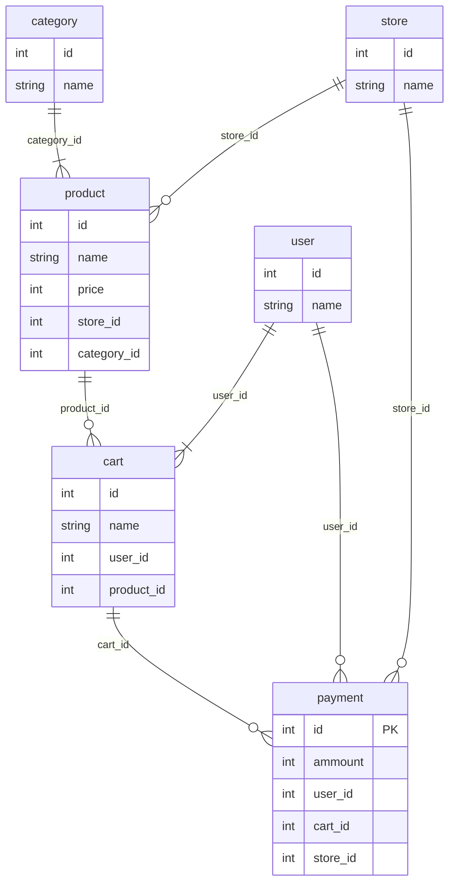

```mermaid
erDiagram
    product {
        int id
        string name
        int price
        int store_id
        int category_id
    }

    category {
        int id
        string name
    }

    store {
        int id
        string name
    }

    user {
        int id
        string name
    }

    cart {
        int id
        string name
        int user_id
        int product_id
    }

    payment {
        int id PK
        int ammount
        int user_id
        int cart_id
        int store_id
    }

    store ||--o{ product : "store_id"
    category ||--|{ product : "category_id"
    user ||--|{ cart : "user_id"
    product ||--o{ cart : "product_id"
    cart ||--o{ payment : "cart_id"
    store ||--o{ payment : "store_id"
    user ||--o{ payment : "user_id"
```
