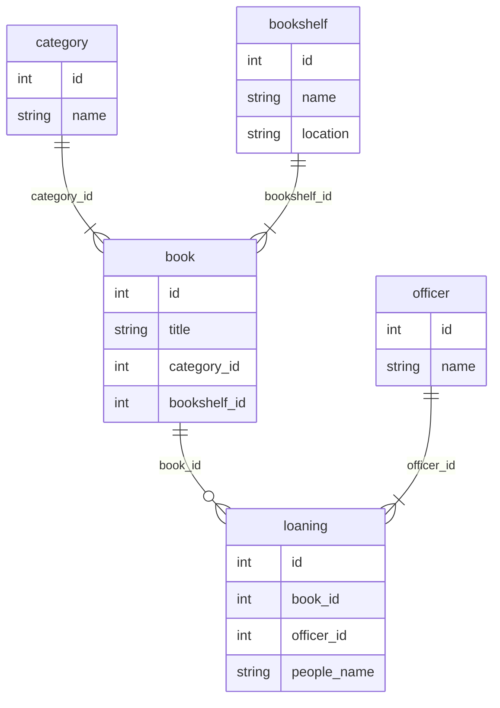

```mermaid
erDiagram
    book {
        int id
        string title
        int category_id
        int bookshelf_id
    }

    category {
        int id
        string name
    }

    bookshelf {
        int id
        string name
        string location
    }

    officer {
        int id
        string name
    }

    loaning {
        int id
        int book_id
        int officer_id
        string people_name
    }

    category ||--|{ book : "category_id"
    bookshelf ||--|{ book : "bookshelf_id"
    book ||--o{ loaning : "book_id"
    officer ||--|{ loaning : "officer_id"
```
